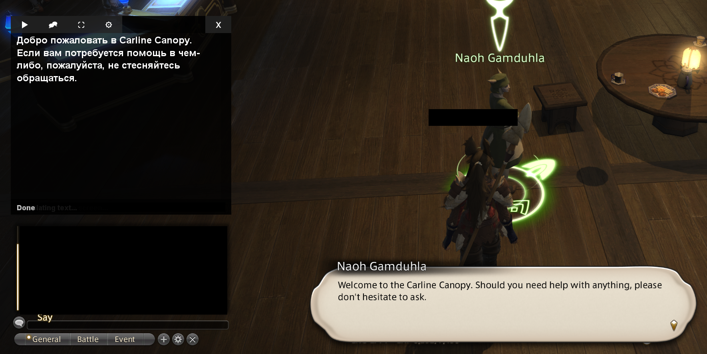

###  Realtime on screen translator

A real-time screen translation tool that captures text from your screen and displays translations in an overlay window. 

Features:
 - Screen Text Capture: Select any area of your screen to capture text for translation

 - Overlay Display: Translations appear in a transparent overlay that stays on top of other applications

 - Multiple OCR Options:

   - WindowsOCR: Uses Windows built-in OCR capabilities (Windows 10+)

   - Tesseract: Open-source OCR engine for broader compatibility

 - Translation: 
   
   - Ollama: Local translation processing using Ollama's AI models

   - Google: simple free online solution

 - Two Operation Modes:

   - Auto Mode: Automatically captures and translates text at regular intervals

   - Manual Mode: Capture text using a hotkey

